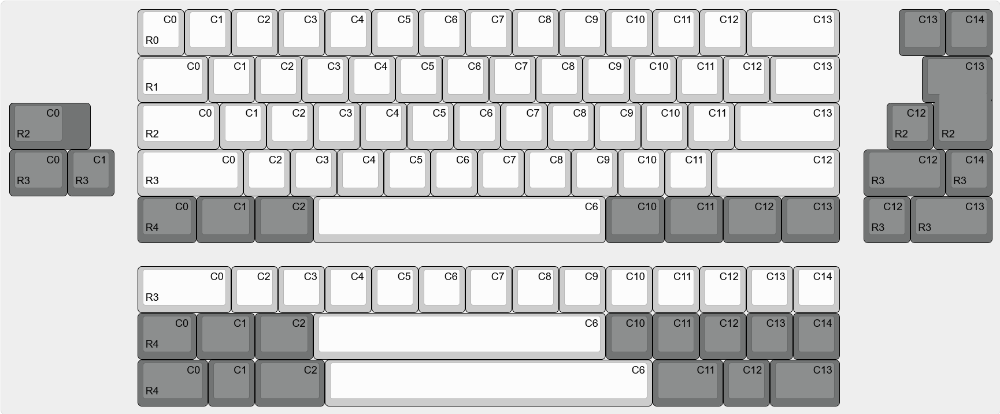

# zmk-config
This is the ZMK-Config repo for the Polarity works BT60 V1 keyboard, with this you can customise your layout and keymap to suit your exact needs.
We have provided base keymaps for the following layouts: ANSI, ISO, Split backspace and right shift, Tsangan and all 1u bottom rows. These can be accessed by choosing the appropriate branch. 

THIS IS NOT THE REPO FOR THE V2/BT65/BT75, those files can be accessed [here](https://github.com/PolarityWorks/zmk-config-ckp)

# Customisation
In order to change the keymap to meet your needs, you will need a GitHub account. Click the "fork" button in the top right to create your own version of the repo, then use the drop down menu to select the branch with your layout.
The keymap information is contained entirely within the file bt60.keymap. Download this file to your computer and open it in a text editor such as Atom or notepad++ then you can open and edit it. The full list of ZMK keycodes can be found [here](https://zmkfirmware.dev/docs/codes/keyboard-keypad/). 
After editing the keymap file upload it to the original folder using the "Add file" dialog in GitHub, then click on "Actions" and wait for the build process to complete (The orange dot will go to either a red X or green tick).

# Compilation and downloading
 If you have made any errors in the keymap the compilation will fail and there will be a red X in the actions dialog. Click on it and it will tell you where the problem is. 
 If the build completes with no errors you will be able to find the firmware in the "Artifacts" section of the last action. 
 Put the keyboard into bootloader (Either double tap the hardware reset button or use the behaviour, typically fn + enter) and drag and drop the .uf2 file onto the usb drive that shows up
 
 # More advanced
 If you want to exercise greater control over your BT60 and have a unique layout implemented you will need to change the matrix transform. The following diagram displays which keys connect to which row and column pins. Note that everything is zero indexed in the matrix transform
 	
  The matrix transform can be found in bt60.dts, more information on how to do the matrix transforms can be found in the official ZMK documentation [here](https://zmkfirmware.dev/docs/development/new-shield#optional-matrix-transform)
  We're always willing to accept pull requests if you've developed your own layouts :)

# Local builds

Steps taken from [ZMK Development Setup](https://zmk.dev/docs/development/setup). Commands have been provided where the steps differ from the documentation. Tested on Ubuntu 20.04.

1. [Install prerequisites](https://zmk.dev/docs/development/setup#prerequisites)
2. [Install `west`](https://zmk.dev/docs/development/setup#west-installation)
3. [Install toolchain](https://zmk.dev/docs/development/setup#toolchain-installation)
4. [Initialize West]([Initialize West](https://zmk.dev/docs/development/setup#initialize-west))
    ```
    west init -l config
    ```
5. [Update To Fetch Modules](https://zmk.dev/docs/development/setup#update-to-fetch-modules)
6. [Export Zephyr™ Core](https://zmk.dev/docs/development/setup#export-zephyr-core)
7. [Install Zephyr Python Dependencies](https://zmk.dev/docs/development/setup#install-zephyr-python-dependencies)
8. Build the firmware 
    ```
    west build -s zmk/app -b bt60 -- -DZMK_CONFIG="$(pwd)/config"
    ```
9. Built firmware will be `build/zephyr/zmk.uf2`
